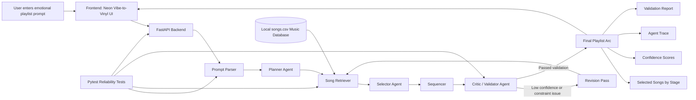

# Vibe-to-Vinyl Curator  
## An Agentic Music Recommendation System for Emotional Playlist Arcs

**Vibe-to-Vinyl Curator** is a full-stack applied AI system that turns a user's emotional music request into a structured, validated playlist arc. Instead of recommending songs only by genre, popularity, or artist similarity, the system interprets the user's desired emotional journey, plans a three-stage playlist, retrieves matching songs from a local music database, sequences them, validates the result, and reports confidence scores.

Example prompt:

> Create a 30-minute playlist that starts anxious, becomes grounded, and ends hopeful. Not too loud.

The system returns a playlist organized by emotional stages, along with song explanations, validation metrics, and an observable agent trace.

---

## Project Links

- **GitHub Repository:** https://github.com/meronoumer/applied-ai-system-project/tree/main/vibe-to-vinyl-curator
- **Loom Demo Walkthrough:** `[Add Loom link here after recording]`

---

## Original Project

This project extends my earlier **Music Recommender Simulation** from a previous AI110 module. The original version focused on basic music recommendation behavior using simple song or preference matching. It was primarily a Python-based simulation that demonstrated recommendation logic, but it did not yet include retrieval, agentic reasoning, validation, guardrails, or a full user-facing interface.

This final version redesigns that prototype into a complete applied AI system. It adds an agentic workflow, retrieval over a structured song database, validation guardrails, confidence scoring, automated tests, logging, and an interactive frontend.

---

## Project Summary

Most music recommendation systems answer:

> What songs are similar to this?

**Vibe-to-Vinyl Curator** answers a more intentional question:

> What emotional journey do you want this playlist to take?

The system treats a playlist as a designed experience. A user can describe a mood, moment, task, or desired emotional transition, and the app creates a playlist that moves through that emotional arc.

For example, a user might request music for:

- coding without lyrics
- walking home at night
- calming down after stress
- hosting a cozy dinner
- transitioning from anxious to grounded
- creating a reflective late-night reset
- moving from low energy into motivation

The final output is not only a song list. It includes:

- a three-stage playlist arc
- selected songs grouped by stage
- explanations for why songs were chosen
- validation scores
- confidence score
- visible agent trace
- guardrail behavior

---

## Why This Project Matters

A basic recommender usually suggests songs based on similarity. This project makes the recommendation process more intentional and explainable.

The system demonstrates that an applied AI product should not only generate an answer, but also:

- interpret user intent
- retrieve relevant data
- follow a multi-step plan
- check its own output
- handle constraints
- report confidence
- expose its process clearly to users

This makes the project more than a generic Spotify clone. It is a niche AI curation system focused on emotional pacing, context, and reliability.

---

## Key Features

### Natural-Language Vibe Input

Users can describe what they want in plain English.

Example:

```text
Create a 30-minute playlist that starts anxious, becomes grounded, and ends hopeful. Not too loud.
```

The system extracts mood, context, constraints, target duration, and listening preferences from the prompt.

---

### Emotional Arc Planning

The system creates a three-stage emotional arc. For example:

```text
Stage 1: anxious/restless
Stage 2: grounded/steady
Stage 3: hopeful/uplifting
```

This makes the playlist feel like a designed experience rather than a flat list of songs.

---

### Retrieval from Local Music Database

The backend retrieves songs from a structured `songs.csv` file. Each song includes metadata such as:

- title
- artist
- genre
- duration
- BPM
- energy
- mood tags
- lyrics level
- explicit content
- best-use context
- description

The system searches this database to find songs that match each emotional stage.

---

### Agentic Workflow

The system uses a modular agentic pipeline:

1. Prompt Parser
2. Planner Agent
3. Song Retriever
4. Selector Agent
5. Sequencer
6. Critic / Validator Agent
7. Revision Step
8. Final Response Generator

This makes the system agentic because it does not simply generate a playlist once. It plans, retrieves, checks, and revises.

---

### Guardrails and Reliability Checks

The system includes guardrails for:

- avoiding explicit songs when explicit content is not allowed
- avoiding medium/high-lyrics songs when the user requests no lyrics
- penalizing high-energy songs when the user asks for something calm or “not too loud”
- warning when the system cannot fully satisfy a request
- avoiding invented songs outside the local database
- returning confidence scores instead of pretending the output is perfect

---

### Confidence Scoring

Each generated playlist receives validation scores for:

- mood match
- transition smoothness
- duration accuracy
- constraint satisfaction
- overall confidence

The overall confidence score is calculated as:

```text
overall_confidence =
0.35 * mood_match
+ 0.25 * transition_smoothness
+ 0.20 * duration_accuracy
+ 0.20 * constraint_satisfaction
```

This makes the recommendation measurable and easier to evaluate.

---

### Interactive Frontend

The frontend uses a neon, vinyl-inspired interface with:

- animated vinyl record
- emotional stage buttons
- dynamic progress bar
- glassmorphism song cards
- validation report panel
- confidence scores
- agent trace section
- prompt chips for sample use cases

The interface is designed to make the AI workflow visible and engaging.

---

## System Architecture

The system is organized as a full-stack app with a Python backend and browser-based frontend.



The architecture diagram is also stored in the `assets/` folder.

Recommended asset files:

```text
assets/architecture.mmd
assets/architecture.png
assets/demo-screenshot.png
```

---

## Repository Structure

```text
vibe-to-vinyl-curator/
│
├── backend/
│   ├── app/
│   │   ├── agent.py
│   │   ├── data_loader.py
│   │   ├── logger_config.py
│   │   ├── main.py
│   │   ├── models.py
│   │   ├── parser.py
│   │   ├── planner.py
│   │   ├── retriever.py
│   │   ├── selector.py
│   │   ├── sequencer.py
│   │   └── validator.py
│   │
│   ├── data/
│   │   └── songs.csv
│   │
│   ├── tests/
│   │   ├── test_agent.py
│   │   ├── test_parser.py
│   │   ├── test_retriever.py
│   │   └── test_validator.py
│   │
│   ├── requirements.txt
│   └── README_BACKEND.md
│
├── frontend/
│   ├── index.html
│   ├── app.js
│   └── styles.css
│
├── assets/
│   ├── architecture.mmd
│   ├── architecture.png
│   └── sample_prompts.json
│
├── README.md
├── model_card.md
├── pytest.ini
└── .gitignore
```

---

## Tech Stack

### Backend

- Python
- FastAPI
- Pydantic
- pandas
- pytest
- Uvicorn

### Frontend

- HTML
- CSS
- JavaScript
- Neon/glassmorphism UI design
- Browser-based frontend served through Live Preview, Live Server, or direct browser opening

### Data

- Local CSV song database
- Metadata-based retrieval and validation

---

## How the Agentic Workflow Works

### 1. Prompt Parser

The parser extracts structured information from the user's natural-language prompt, including:

- occasion
- starting mood
- middle mood
- ending mood
- target duration
- constraints
- lyrics preference
- explicit content preference
- preferred energy level

Example:

```text
Input:
Create a 30-minute playlist that starts anxious, becomes grounded, and ends hopeful. Not too loud.

Parsed intent:
start_mood = anxious
middle_mood = grounded
end_mood = hopeful
target_duration_minutes = 30
constraint = not too loud
preferred_energy = medium-low
```

---

### 2. Planner Agent

The planner converts the parsed intent into a three-stage emotional arc.

Example:

```text
Opening: anxious/restless
Middle: grounded/steady
Closing: hopeful/uplifting
```

Each stage includes target mood, target energy, and a description of its role in the playlist.

---

### 3. Song Retriever

The retriever searches the local song database for candidates that match each stage. It scores songs based on:

- mood tag overlap
- mood synonym match
- energy closeness
- use-case match
- lyrics constraints
- explicit-content constraints

---

### 4. Selector Agent

The selector chooses songs for each stage based on retrieval score and constraints. It avoids duplicates and generates explanations for why each song was selected.

---

### 5. Sequencer

The sequencer orders songs to create a smoother emotional and energy transition. It tries to avoid large energy jumps between adjacent songs.

---

### 6. Critic / Validator Agent

The validator scores the playlist using:

- mood match
- transition smoothness
- duration accuracy
- constraint satisfaction

It also generates warnings when a playlist does not fully satisfy the request.

---

### 7. Revision Step

If confidence or constraint satisfaction is too low, the system performs one revision pass. For example, it may remove songs that violate constraints or resequence songs for smoother transitions.

---

### 8. Final Output

The backend returns:

- parsed intent
- playlist arc
- selected songs by stage
- validation report
- confidence score
- agent trace

---

## API Endpoints

| Endpoint | Method | Purpose |
|---|---|---|
| `/` | GET | Returns project metadata and available endpoints |
| `/health` | GET | Confirms the backend is running |
| `/songs` | GET | Returns all songs from the local database |
| `/curate` | POST | Generates a playlist arc from a user prompt |
| `/evaluate` | POST | Runs batch evaluation over multiple prompts |
| `/docs` | GET | Opens FastAPI interactive API docs |

---

## Setup Instructions

### 1. Clone the Repository

```bash
git clone https://github.com/meronoumer/applied-ai-system-project.git
cd applied-ai-system-project/vibe-to-vinyl-curator
```

---

### 2. Set Up the Backend

Move into the backend folder:

```bash
cd backend
```

Create a virtual environment:

```bash
python -m venv .venv
```

Activate it.

On Windows PowerShell:

```powershell
.\.venv\Scripts\Activate.ps1
```

On macOS/Linux:

```bash
source .venv/bin/activate
```

Install dependencies:

```bash
pip install -r requirements.txt
```

Start the backend:

```bash
python -m uvicorn app.main:app --reload
```

The backend should run at:

```text
http://127.0.0.1:8000
```

You can open the interactive API docs at:

```text
http://127.0.0.1:8000/docs
```

---

### 3. Run the Frontend

Keep the backend running.

Open:

```text
frontend/index.html
```

using one of the following:

- VS Code Live Preview
- VS Code Live Server
- a browser window

The frontend sends requests to:

```text
http://127.0.0.1:8000/curate
```

---

## Running Tests

Run tests from the `vibe-to-vinyl-curator` project root:

```bash
python -m pytest
```

Current test result:

```text
7 passed
```

The tests cover:

- prompt parsing
- no-lyrics detection
- retrieval scoring
- explicit-content guardrails
- validation scoring
- full agent response structure
- evaluation summary calculations

---

## Sample Interactions

### Example 1: Emotional Regulation Playlist

**Input**

```text
Create a 30-minute playlist that starts anxious, becomes grounded, and ends hopeful. Not too loud.
```

**Expected Behavior**

The system creates a three-stage playlist arc:

```text
Stage 1: anxious / restless
Stage 2: grounded / steady
Stage 3: hopeful / uplifting
```

The system should avoid overly high-energy tracks because the prompt says “not too loud.” The validation report should show mood match, transition smoothness, duration accuracy, constraint satisfaction, and overall confidence.

**What this demonstrates**

- emotional arc planning
- energy guardrail
- validation scoring
- agent trace

---

### Example 2: Coding Playlist With No Lyrics

**Input**

```text
I want background music for coding with no lyrics. Keep it focused and steady.
```

**Expected Behavior**

The parser detects a coding/focus use case and a no-lyrics constraint. The retriever avoids songs with medium or high lyrical content and favors songs tagged as focused, steady, minimal, or instrumental.

**What this demonstrates**

- constraint extraction
- no-lyrics guardrail
- retrieval over song metadata
- explainable recommendations

---

### Example 3: Cozy Dinner Playlist

**Input**

```text
Make a cozy dinner playlist that starts warm, becomes intimate, and ends nostalgic.
```

**Expected Behavior**

The system creates a warmer social listening arc. It retrieves songs tagged with moods such as warm, cozy, intimate, nostalgic, reflective, or related emotional tags. The output is sequenced as a dinner playlist rather than a random collection of songs.

**What this demonstrates**

- occasion-based curation
- mood sequencing
- retrieval-based song selection
- validation report

---

## Reliability and Evaluation

This project includes multiple reliability mechanisms.

### Automated Tests

The backend includes a pytest suite that tests the core components of the system.

Tested components include:

- parser
- retriever
- validator
- full agent workflow
- evaluation calculation

Current result:

```text
7 passed
```

---

### Confidence Scoring

The system calculates an overall confidence score using:

```text
overall_confidence =
0.35 * mood_match
+ 0.25 * transition_smoothness
+ 0.20 * duration_accuracy
+ 0.20 * constraint_satisfaction
```

This allows the system to communicate how well the playlist satisfied the user's request.

---

### Validation Metrics

The validation report includes:

| Metric | Meaning |
|---|---|
| Mood Match | How well selected songs match the requested emotional stages |
| Transition Smoothness | How smoothly the energy changes across adjacent songs |
| Duration Accuracy | How close the playlist is to the requested duration |
| Constraint Satisfaction | Whether the playlist follows guardrails like no lyrics or no explicit content |
| Overall Confidence | Weighted summary score across all validation metrics |

---

### Guardrails

The system includes guardrails for:

- explicit content
- lyrical content
- high-energy songs when the user asks for calm music
- missing or malformed song data
- low-confidence playlists
- insufficient matches in the local database

The system does not invent songs outside the database.

---

### Logging and Error Handling

The backend includes request logging and error handling. If curation, evaluation, or song loading fails, the backend logs the issue and returns a user-readable error message.

---

## Design Decisions

### Deterministic First

I chose to build the system as a deterministic agentic workflow instead of relying completely on an external LLM. This made the project easier to test, easier to debug, and more reproducible for a grader or future employer.

The system still demonstrates AI-style reasoning because it:

- parses natural-language intent
- plans a multi-stage playlist
- retrieves songs from data
- checks constraints
- validates quality
- performs a revision pass

The trade-off is that the system is less flexible than a fully LLM-powered product. However, the deterministic approach made reliability and guardrails much clearer.

---

### Local CSV Instead of Spotify API

I used a local `songs.csv` database instead of the Spotify API. This avoided authentication issues and made the project easier to run locally.

The trade-off is that the song catalog is smaller and manually curated. In a future version, I would expand this with Spotify API integration or a larger public dataset.

---

### Visible Agent Trace

I included an agent trace so users can see the major steps the system followed. This makes the system feel more transparent and helps demonstrate the agentic workflow for the project requirements.

The trace does not reveal hidden chain-of-thought. It only shows concise operational summaries such as parser, planner, retriever, selector, sequencer, critic, and revision.

---

### Frontend as Product Experience

I designed the frontend to feel like a real product, not just a class script. The neon vinyl interface communicates the emotional/music theme while also showing technical outputs like validation scores and agent steps.

---

## Limitations

This system has several limitations:

- The song database is small and manually curated.
- Mood tags are subjective and may reflect my own interpretation.
- The parser is keyword-based and may misinterpret ambiguous language.
- The system does not currently learn from user feedback.
- It does not export playlists to Spotify or Apple Music.
- It does not use audio features directly from music files.
- Genre and cultural coverage may be limited by the local dataset.
- The system should not be treated as a mental health tool, even though it uses emotional language.

---

## Bias and Ethics

The system relies on manually assigned metadata. This can introduce bias because mood labels, genre labels, and “best use” tags are subjective. A song that feels calming to one listener may feel sad, boring, or intense to another listener.

The system also uses emotional language, so it is important not to overstate what it can do. Vibe-to-Vinyl Curator can support music discovery and mood-based curation, but it cannot diagnose emotions or provide mental health treatment.

To reduce risk, the system:

- frames outputs as recommendations
- shows confidence scores
- includes validation warnings
- avoids claiming that the playlist is objectively perfect
- documents limitations clearly

---

## What I Learned

This project taught me that applied AI systems are not just about producing outputs. A useful AI system needs structure, validation, guardrails, error handling, documentation, and a clear user experience.

One major lesson was that backend logic can work correctly while the full app still fails because of integration issues. For example, my backend tests passed, but the frontend initially had fetch/CORS and response-shape issues. Debugging those problems helped me better understand full-stack AI engineering.

I also learned that reliability depends on how well each component communicates with the next. The parser, retriever, selector, validator, and frontend all needed to agree on the same data structure.

---

## Future Work

Future improvements could include:

- Spotify API integration
- playlist export
- larger music database
- embeddings-based semantic retrieval
- optional LLM planner with deterministic fallback
- user feedback and personalization
- better ambiguity handling in the parser
- more diverse cultural and genre coverage
- audio-feature extraction from real tracks
- human evaluation comparing baseline recommendations to validated playlist arcs

---

## Demo Walkthrough

Loom walkthrough link:

```text
[Add Loom link here]
```

The walkthrough demonstrates:

1. Starting the FastAPI backend.
2. Opening the frontend.
3. Running an emotional arc prompt.
4. Showing the generated playlist stages.
5. Showing the validation report.
6. Showing the agent trace.
7. Running a no-lyrics prompt to demonstrate guardrail behavior.
8. Mentioning the test suite result.

Recommended demo prompts:

```text
Create a 30-minute playlist that starts anxious, becomes grounded, and ends hopeful. Not too loud.
```

```text
I want background music for coding with no lyrics. Keep it focused and steady.
```

```text
Make a cozy dinner playlist that starts warm, becomes intimate, and ends nostalgic.
```

---

## Portfolio Reflection

Vibe-to-Vinyl Curator shows my ability to evolve a simple prototype into a complete applied AI system. I designed a modular Python backend with agentic planning, retrieval over structured song metadata, validation metrics, guardrails, logging, and automated tests. I also built an interactive frontend that makes the AI workflow visible through playlist stages, confidence scores, and an agent trace.

This project reflects the kind of AI engineering I am interested in: systems that are creative and user-centered, but also explainable, testable, and reliable.

---

## Final Project Checklist

- [x] Extended an earlier music recommender project
- [x] Implemented a full applied AI system
- [x] Added retrieval over a local song database
- [x] Added agentic workflow
- [x] Added validation and confidence scoring
- [x] Added guardrails
- [x] Added logging and error handling
- [x] Added automated tests
- [x] Built an interactive frontend
- [x] Added architecture diagram source
- [x] Added model card
- [ ] Add exported architecture image
- [ ] Add Loom walkthrough link
- [ ] Add final demo screenshot
- [ ] Confirm final push before submission

---

## Author

**Meron Oumer**  
AI110 Foundations of AI Engineering  
Final Project: Applied AI System